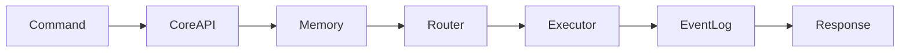

# How Aether Works

## The Sacred Contract
Every request follows:

**Brain Router (future Skill 6)**: Analyzes task (reasoning needed? tools? privacy?) and selects best AI + spawns dev agents.

## Extending with New Skill
1. Add folder in `app/modules/yourskill/`
2. Register router in main.py or __init__
3. Implement against contracts.

See Skill template in Plugin Generator (Skill 9).